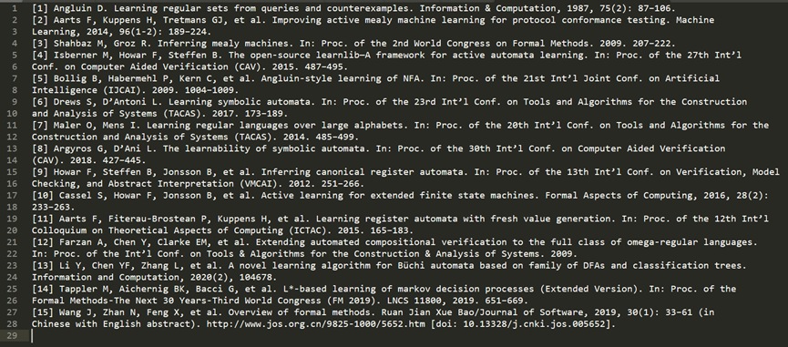
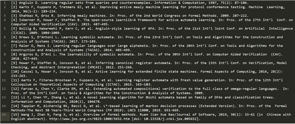

# 1.运行app
双击文件app1_run.bat

# 2.粘贴
把剪切板的内容粘贴到框1
# 3.复制
把框2的内容复制到剪切板
# 4.接处理剪切板
无需点击粘贴，自动帮你把剪切板的内容粘贴到框1
# 5.直接粘贴到剪切板
无需点击复制，自动帮你把框2的内容复制到剪切板
# 6.参考文献.多行格式化
## 6.1.说明
将从pdf复制而来的多行参考文献整理成一行一条文献的格式
## 6.2.示例
### 6.2.1.示例1
处理前

处理后

### 6.2.2.示例2（序号不带中括号）

处理前

处理后

# 7.   摘要.按分号分隔

## 7.1.  说明

## 7.2.  示例

### 7.2.1. 示例1

处理前后

# 8.日志输出

打印到app/../app1_logs路径下

## 8.1.  示例

